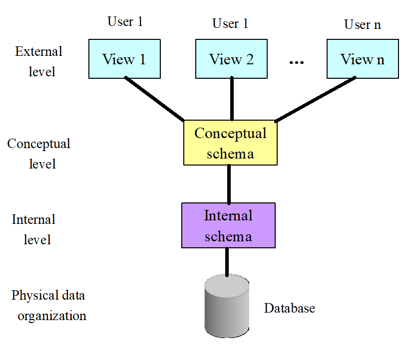

## 第一章 绪论

### 一、数据库的四个基本概念

1. **数据 data**：描述事物的符号，数据库中存储的基本对象
2. **数据库 Database, DB**：长期存储在计算机内的、有组织的、可共享的大量数据的集合
3. **数据库管理系统 Database Management System, DBMS**：位于用户与操作系统之间的一层数据管理软件
4. **数据库系统 Database System, DBS**：由数据库、数据库管理系统、应用程序和数据库管理员（DBA）組成

### 二、数据库系统的特点

1. 数据结构化
2. 数据的共享性高，冗余度低而且容易扩充
3. 数据独立性高：<u>物理独立性（应用程序与物理存储相互独立，数据的物理存储改变，应用程序不改变），逻辑独 立性（应用程序与逻辑结构相互独立，数据的逻辑结构改变，应用程序不改变）</u>
4. 数据由数据库管理系统统一管理和控制

### 三、数据模型

数据模型包括概念模型（信息模型）和逻辑模型/物理模型

+ 概念模型按用户的观点建模，用于数据库设计，表示方法有E-R模型
+ 逻辑模型按计算机的观点建模，用于DBMS实现，包括网状模型、层次模型、关系模型等等
+ 物理模型是对数据最底层的抽象

### 四、数据模型的组成要素：数据结构、数据操作、数据的完整性约束条件

数据模型是严格定义的一组概念的集合，需要精确描述系统的静态特性、动态特性和完整性约束条件因此数据模型由以下三个部分组成：

1. 数据结构：描述系统的静态特性一描述数据库的组成对象以及对象之间的联系
2. 数据操作：描述系统的动态特性一是对数据库中各种对象的实例所允许的操作的集合，其类型有査询和更新（增 删改）
3. 数据的完整性约束条件：用以限定符合数据模型的数据库状态以及状态的变化，以保证数据的正确、有效与相 容，完整性约束条件是一组完整性规则的集合

### 五、数据库系统的三级模式结构：外模式、模式（逻辑模式）、内模式

1. **外模式**（子模式/用户模式）：**对应于数据的不同视图**。数据库用户能够看见和使用的局部数据的逻辑结构和特征的描述，数据库用户的数 据视图，是与某应用有关的数据的逻辑表示
2. **概念模式**（逻辑模式）：**描述所有的实体、属性和关系以及完整性约束**。数据库中全体数据的逻辑结构和特征的描述，是所有用户的公共数据视图
3. **内模式**（存储模式）：**描述内部模型。包含存储记录的定义、表示方法、数据字段、............**。数据物理结构和存储方法的描述，是数据在数据库内部的组织方式

### 六、数据库的二级映像功能与数据独立性

1. **外模式/模式映像**：保证了数据的逻辑独立性

   当模式改变时，对外模式/概念模式的映像做出改变，保证外模式不变，应用程序由外模式编写，从而应用程序不变

   

2. **概念模式/内模式映像**：保证了数据的物理独立性

   当数据库的存储结构改变时，对模式/内模式映像做出改变，使模式不变，进而应用程序不变

