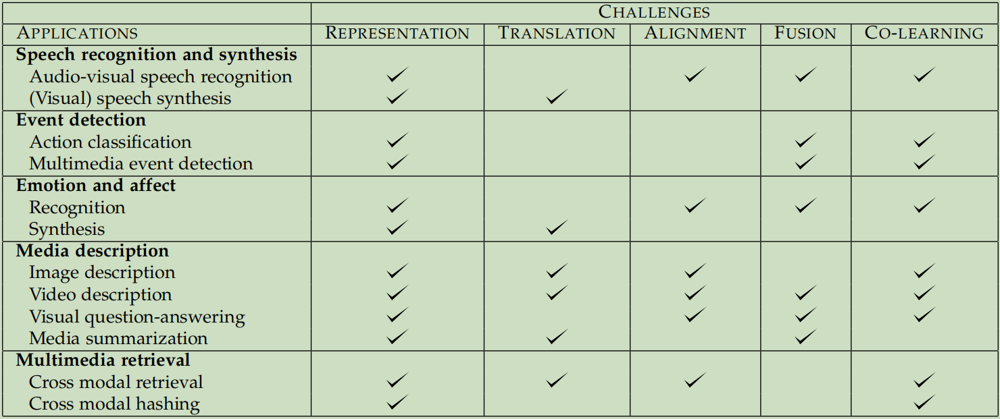

[相关论文](Multimodal-Machine-Learning-A-Survey-and-Taxonomy\Multimodal Machine Learning A Survey and Taxonomy.pdf)

## 1. Introduction

### A. Definition

A research problem or dataset is therefore characterized as *multimodal* when it includes multiple such modalities.

### B. Three modalities we focus primarily

1. natural language
2. visual signals
3. vocal signals

### C. Five challenges in Multimodal Machine Learning

也就是多模态研究的五个方向。

#### 1) Representation

Learning how to **represent and summarize multimodal data** in a way that exploits the complementarity（互补性） and redundancy（冗余性） of multiple modalities.

#### 2) Translation

**Translating(Mapping) data** from one modality to another.

#### 3) Alignment（对齐）

**Identifying the direct relations** between (sub)elements from two or more different modalities.

#### 4) Fusion （融合）

Joining information from two or more modalities to **perform a prediction**.

#### 5) Co-learning

**Transferring knowledge** between modalities, their representation, and their predictive models. 

以上是对多模态研究的五个方向的简略介绍，将在下文详细介绍。

## 2. APPLICATIONS: A HISTORICAL PERSPECTIVE

Some examples:

1. audio-visual speech recognition (AVSR) 视听语音识别
2. the field of multimedia content indexing and retrieval 多媒体内容的索引和检索
3. visual question-answering 视觉问答

## 3. MULTIMODAL REPRESENTATIONS

多模态表示学习是指通过利用多模态之间的互补性，剔除模态间的冗余性，从而学习到更好的特征表示。

多模态表示分为两类：

### A. Joint representation 联合表示

概念：联合表示将多个模态的信息一起映射到一个统一的多模态向量空间

应用：

### B. Coordinated Representation 协同表示

概念：协同表示负责将多模态中的每个模态分别映射到各自的表示空间，但映射后的向量之间满足一定的相关性约束（例如线性相关）

应用：

## 4. Translation

