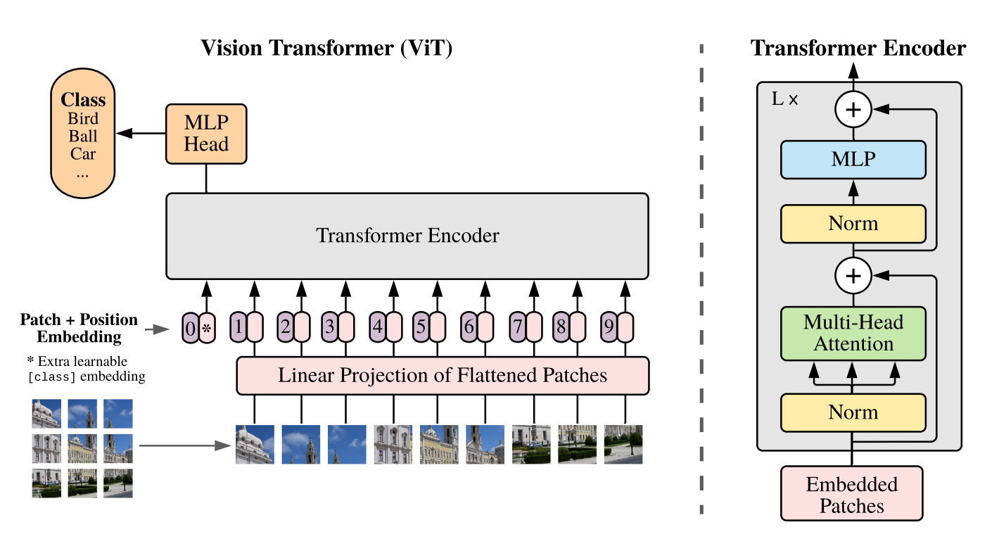

本文将以模型解释与代码结合起来，来向大家解释Vision Transformer Model(ViT)


论文地址如下：

[An Image is Worth 16x16 Words: Transformers for Image Recognition at Scale](https://arxiv.org/abs/2010.11929)

[论文代码](https://github.com/google-research/vision_transformer)


## 论文模型总览

我们将图像分割成固定大小的块，线性嵌入每个块，添加位置嵌入，并将生成的向量序列馈送到标准的`Transformer`编码器。为了执行分类，我们使用向序列添加额外可学习的“分类标记”的标准方法。




## 分块与降维

对于图像来讲，一般是三通道（BGR256）的彩色图片，但是我们想用现成的`Transformer`模型对图像进行处理，那么我们就应该对图像进行降维处理。

首先把$\mathbf{x}_{p} \in \mathbb{R}^{H \times W \times C}$的图像，变成一个$\mathbf{x}_{p} \in \mathbb{R}^{N \times\left(P^{2} \cdot C\right)}$的**sequence of flattened 2D patches**。其可视为一系列的展平的2D块的序列，这个序列中一共有$N = \frac{ HW }{P^{2}}$个展平的2D块，$N$即为`Transformer`输入的`sequence`的长度。其中每个块的维度是$\left(P^2 \cdot C \right)$，其中$H$和$W$是图像的高和宽，$P$是块大小，$C$是图片的通道数。

那么这一步在代码中是怎么做的呢？

我们通过`from einops import rearrange`来解决这个问题

``` python
x = rearrange(img, 'b c (h p1) (w p2) -> b (h w) (p1 p2 c)', p1=p, p2=p)
```

实例：

``` python
# 假设我们现在有个torch.tensor类型的img变量
img.shape
#Out: torch.Size([10, 32, 100, 200])
p = 2
x = rearrange(img, 'b c (h p1) (w p2) -> b (h w) (p1 p2 c)', p1=p, p2=p)

x.shape
# Out: torch.Size([10, 5000, 128])
```

参考文章：[einops：优雅地操作张量维度](https://zhuanlan.zhihu.com/p/342675997)


## Patch Embedding

上一步我们已经得到了一个二维向量$\mathbf{x}_{p} \in \mathbb{R}^{N \times\left(P^{2} \cdot C\right)}$，要转化为$\left(N, D \right)$，我们需要进行**Patch Embedding**，即相当于NLP中的word embedding，做一个线性变换（即全连接层）。具体操作如下：

图像共切分为$N = \frac{HW}{P^{2}}$个patches，这便是sequence的长度，需要注意的是这里直接将Patch拉平为1-D，其特征大小为$P^{2} \cdot C$，然后通过一个线性变换奖patches映射到D大小的维度，这就是patch的embeddings。（这等同于对$\mathbf{x}$做一个$P \times P$的且stride为P的卷积操作）
$$
\mathbf{z}_{0}=\left[\mathbf{x}_{\text {class }} ; \mathbf{x}_{p}^{1} \mathbf{E} ; \mathbf{x}_{p}^{2} \mathbf{E} ; \cdots ; \mathbf{x}_{p}^{N} \mathbf{E}\right]+\mathbf{E}_{p o s}
$$
全连接层就是（1）式中的$\mathbf{E}$，它的输入维度大小是$\left( P^2 \cdot C  \right)$，输出维度大小是$D$。

``` python
# 将维度从patch_dim转化为dim
self.patch_to_embedding = nn.Linear(patch_dim, dim)
x = self.patch_to_embedding(x)
```

注意这里的$\mathbf{x}_{\text {class }}$ ，假设切成9个块，但是最终到Transfomer输入是10个向量，这是人为增加的一个向量。

这么做的原因可以理解为：ViT其实只用到了Transformer的Encoder，而并没有用到Decoder，而$\mathbf{x}_{\text {class }}$的作用有点类似于解码器中的**Query**的作用，相对应的**Key, Value**就是其他9个编码向量的输出。

$\mathbf{x}_{\text {class }}$是一个可学习的嵌入向量，它的意义说通俗一点为：寻找其他9个输入向量对应的**img**的类别。

``` python
class PatchEmbed(nn.Module):
    """ Image to Patch Embedding
    """
    def __init__(self, img_size=224, patch_size=16, in_chans=3, embed_dim=768):
        super().__init__()
        img_size = to_2tuple(img_size)
        patch_size = to_2tuple(patch_size)
        num_patches = (img_size[1] // patch_size[1]) * (img_size[0] // patch_size[0])
        self.img_size = img_size
        self.patch_size = patch_size
        self.num_patches = num_patches

        self.proj = nn.Conv2d(in_chans, embed_dim, kernel_size=patch_size, stride=patch_size)

    def forward(self, x):
        B, C, H, W = x.shape
        # FIXME look at relaxing size constraints
        assert H == self.img_size[0] and W == self.img_size[1], \
            f"Input image size ({H}*{W}) doesn't match model ({self.img_size[0]}*{self.img_size[1]})."
        x = self.proj(x).flatten(2).transpose(1, 2)
        return x
```


## Position Encoding

按照Transformer的位置编码的习惯，这个工作也使用了位置编码。**引入了一个 Positional encoding**$\mathbf{E}_{p o s}$**来加入序列的位置信息**，同样在这里也引入了**pos_embedding**，与最初的Transformer模型不同，这是**用一个可训练的变量**。

$$
\mathbf{z}_{0}=\left[\mathbf{x}_{\text {class }} ; \mathbf{x}_{p}^{1} \mathbf{E} ; \mathbf{x}_{p}^{2} \mathbf{E} ; \cdots ; \mathbf{x}_{p}^{N} \mathbf{E}\right]+\mathbf{E}_{p o s}
$$

``` python
# num_patches=64，dim=1024,+1是因为多了一个cls开启解码标志
self.pos_embedding = nn.Parameter(torch.randn(1, num_patches + 1, dim))

# patch emded + pos_embed
x = x + self.pos_embed
```


``` python
def resize_pos_embed(posemb, posemb_new):
    # Rescale the grid of position embeddings when loading from state_dict. Adapted from
    # https://github.com/google-research/vision_transformer/blob/00883dd691c63a6830751563748663526e811cee/vit_jax/checkpoint.py#L224
    _logger.info('Resized position embedding: %s to %s', posemb.shape, posemb_new.shape)
    ntok_new = posemb_new.shape[1]
    # 除去class token的pos_embed
    posemb_tok, posemb_grid = posemb[:, :1], posemb[0, 1:]
    ntok_new -= 1
    gs_old = int(math.sqrt(len(posemb_grid)))
    gs_new = int(math.sqrt(ntok_new))
    _logger.info('Position embedding grid-size from %s to %s', gs_old, gs_new)
    # 把pos_embed变换到2-D维度再进行插值
    posemb_grid = posemb_grid.reshape(1, gs_old, gs_old, -1).permute(0, 3, 1, 2)
    posemb_grid = F.interpolate(posemb_grid, size=(gs_new, gs_new), mode='bilinear')
    posemb_grid = posemb_grid.permute(0, 2, 3, 1).reshape(1, gs_new * gs_new, -1)
    posemb = torch.cat([posemb_tok, posemb_grid], dim=1)
    return posemb
```


## Transformer的前向过程

$$
\begin{array}{ll}
\mathbf{z}_{0}=\left[\mathbf{x}_{\text {class }} ; \mathbf{x}_{p}^{1} \mathbf{E} ; \mathbf{x}_{p}^{2} \mathbf{E} ; \cdots ; \mathbf{x}_{p}^{N} \mathbf{E}\right]+\mathbf{E}_{\text {pos }}, & \mathbf{E} \in \mathbb{R}^{\left(P^{2} \cdot C\right) \times D}, \mathbf{E}_{p o s} \in \mathbb{R}^{(N+1) \times D} \\
\mathbf{z}_{\ell}^{\prime}=\operatorname{MSA}\left(\operatorname{LN}\left(\mathbf{z}_{\ell-1}\right)\right)+\mathbf{z}_{\ell-1}, & \ell=1 \ldots L \\
\mathbf{z}_{\ell}=\operatorname{MLP}\left(\operatorname{LN}\left(\mathbf{z}_{\ell}^{\prime}\right)\right)+\mathbf{z}_{\ell}^{\prime}, & \ell=1 \ldots L \\
\mathbf{y}=\operatorname{LN}\left(\mathbf{z}_{L}^{0}\right) &
\end{array}
$$

其中，第1个式子为上面讲到的**Patch Embedding**和**Positional Encoding**的过程。

第二个式子为**Transformer Encoder**的**Multi-head Self-attention**，**Add and Norm**的过程，重复L次

第二个式子为**Transformer Encoder**的**Feed forward Network，Add and Norm**的过程，重复L次

最后是一个**MLP**的**Classification Head**，整个的结构只有这些。


